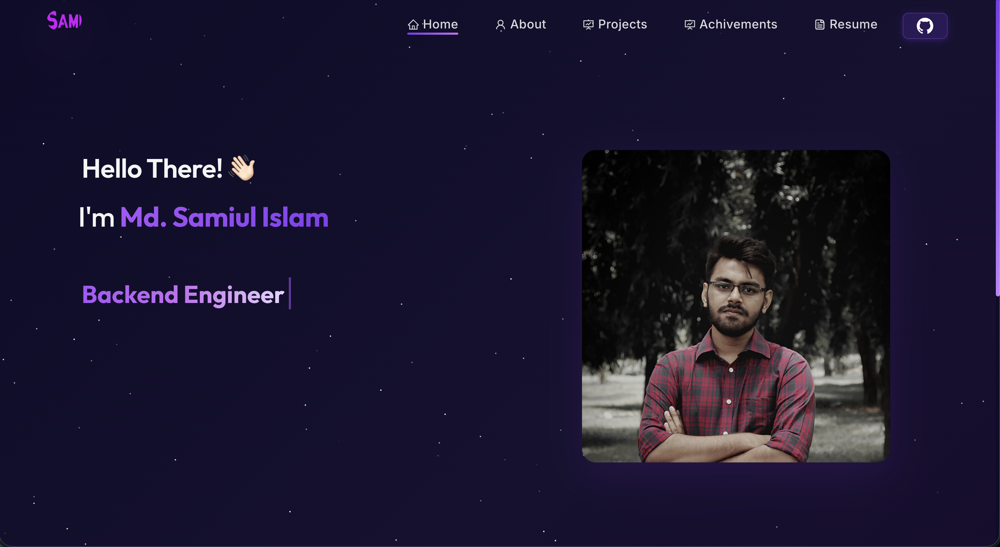

<h1 align="center">
  
</h1>

<p align="center">
  <a href="https://github.com/MDSAMIULSAMI"></a>
  <a href="https://www.linkedin.com/in/md-samiul-islam-17738a1b9/"></a>
  <a href="mailto:mdsamiulislam2172@gmail.com"></a>
</p>

---

<p align="center">
  
</p>

---

## About

A modern, responsive personal portfolio built with **React.js**, featuring a sleek dark theme with glassmorphism design, smooth animations, and gradient accents. Showcases my professional experience, projects, research publications, certifications, and technical skills.

## Tech Stack

| Category | Technologies |
|----------|-------------|
| **Frontend** | React 17, React Router v6, React Bootstrap |
| **Styling** | Vanilla CSS, Bootstrap 5, Google Fonts (Inter, Outfit) |
| **Animations** | CSS Keyframes, tsParticles, Typewriter Effect |
| **PDF Viewer** | react-pdf |
| **Icons** | react-icons (Ai, Si, Bs, Cg, Bi, Fa, Im, Di) |
| **Deployment** | GitHub Pages (gh-pages) |

## Project Structure

```
sami-portfolio/
├── public/
│   └── index.html
├── src/
│   ├── Assets/              # Images, resume PDF, certificates
│   ├── components/
│   │   ├── Home/            # Home.js, Home2.js, Type.js
│   │   ├── About/           # About.js, AboutCard.js, Techstack.js, Toolstack.js, Github.js
│   │   ├── Projects/        # Projects.js, ProjectCards.js
│   │   ├── Achivements/     # Achivements.js, AchivementsCard.js
│   │   ├── Resume/          # ResumeNew.js
│   │   ├── Navbar.js
│   │   ├── Footer.js
│   │   ├── Particle.js
│   │   ├── Pre.js
│   │   └── ScrollToTop.js
│   ├── App.js
│   ├── style.css            # Main design system
│   ├── index.css            # Font imports & body styles
│   └── App.css
└── package.json
```

## Getting Started

### Prerequisites

- **Node.js** ≥ 14.x
- **npm** ≥ 6.x

### Installation

```bash
# Clone the repository
git clone https://github.com/MDSAMIULSAMI/Md-Samiul-Islam-Portfolio-React.git
cd sami-portfolio

# Install dependencies
npm install

# Start development server
npm start
```

The app will open at [http://localhost:3000](http://localhost:3000).

### Build for Production

```bash
npm run build
```

### Deploy to GitHub Pages

```bash
npm run deploy
```

## Pages

| Page | Route | Description |
|------|-------|-------------|
| **Home** | `/` | Hero section with typewriter animation, photo, and introduction |
| **About** | `/about` | Bio, tech stack icons, tool stack, GitHub contribution calendar |
| **Projects** | `/project` | 8 project cards — AI Assistant, CLIP Search, RoBERTa-SAN, and more |
| **Achievements** | `/achivements` | Research papers and course certifications |
| **Resume** | `/resume` | Embedded PDF viewer with download button |

## Design Features

- **Dark Theme** — Deep purple gradient background with starfield particles
- **Glassmorphism Cards** — Frosted glass effect with `backdrop-filter: blur`
- **Gradient Accents** — Animated gradient text, gradient buttons, and gradient scrollbar
- **Active Nav Highlight** — Current page highlighted with purple accent + underline
- **Consistent Card Layout** — Flexbox-based cards with fixed image/title/description/button zones
- **Fully Responsive** — Optimized for desktop, tablet, and mobile
- **Micro-Animations** — Floating images, hover lifts, slide-in interests, wave hand

## Contact

- **Email:** mdsamiulislam2172@gmail.com
- **GitHub:** [MDSAMIULSAMI](https://github.com/MDSAMIULSAMI)
- **LinkedIn:** [Md. Samiul Islam](https://www.linkedin.com/in/md-samiul-islam-17738a1b9/)

---

<p align="center">
  Designed & Built by <strong>Md. Samiul Islam</strong>
</p>
